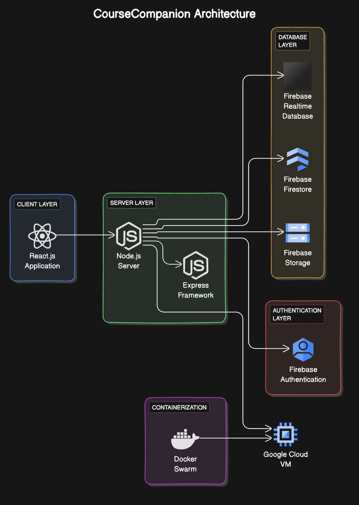

# Course Companion Setup Instructions
CourseCompanion is a platform for students to upload study materials, collaborate, and seek help. It addresses challenges in managing resources and connecting with peers.


## Step 1: Setup

1. git clone https://github.com/dheerajram13/CourseCompanion
cd CourseCompanion
2. Create a firebase project and enable fire store, real-time db, and firebase auth. Create a .env in backend with key FIREBASE_DB_URL="" # firebase database url
3. Run with docker 
 ```bash
sudo apt install apt-transport-https ca-certificates curl software-properties-common -y
curl -fsSL https://download.docker.com/linux/ubuntu/gpg | sudo apt-key add -
sudo add-apt-repository "deb [arch=amd64] https://download.docker.com/linux/ubuntu $(lsb_release -cs) stable"
sudo apt update
sudo apt install docker-ce -y
sudo curl -L "https://github.com/docker/compose/releases/latest/download/docker-compose-$(uname -s)-$(uname -m)" -o /usr/local/
```
4. Docker Swarm 
 ```bash
sudo docker swarm init
sudo docker build -t coursecompanion_frontend:latest ./frontend
sudo docker build -t coursecompanion_backend:latest ./backend
sudo docker stack deploy --compose-file docker-compose.yml coursecompanion
sudo docker stack ps coursecompanion
  ```

5. Run without docker and enter 
open a terminal 
 ```bash
cd backend 
npm install 
npm start 
  ```
open another terminal and enter
 ```bash
cd backend 
npm install 
npm start 
  ```


The site will be up and running. 


# Architecture: 

